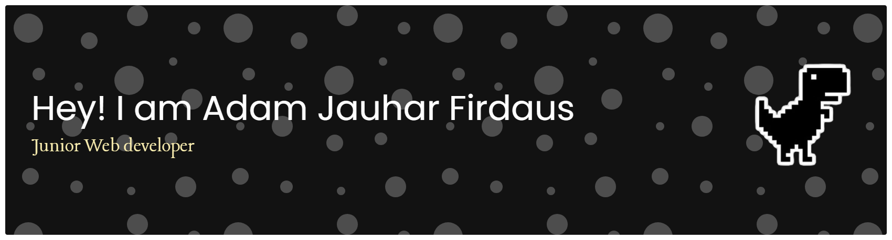

<div align="center">



# Halo, saya Adam Jauhar Firdaus 👋

### Mahasiswa Teknik Informatika | Web Development Enthusiast | Learner

Saya sedang fokus belajar dan mengembangkan kemampuan di bidang **Web Development**, terutama menggunakan **HTML, CSS, PHP, Laravel, JavaScript, MySQL, Git, dan GitHub**.

Saya tertarik membangun aplikasi web yang sederhana, rapi, mudah digunakan, dan memiliki struktur kode yang jelas.

</div>

---

## Tentang Saya

* 🎓 Mahasiswa Teknik Informatika
* 💻 Sedang belajar Full Stack Web Development
* 🌱 Fokus pada PHP Native, Laravel, JavaScript, dan MySQL
* 🧩 Tertarik pada pengembangan sistem informasi berbasis web
* 🔧 Terbiasa menggunakan VS Code, Laragon, phpMyAdmin, Git, dan GitHub
* 🚀 Sedang membangun beberapa project pembelajaran berbasis web

---

## Tech Stack

<div align="center">

### Bahasa dan Markup


### Framework dan Library


### Database dan Tools


</div>

---

## Fokus Belajar Saat Ini

```text
PHP Native       █████████░░  80%
Laravel          ███████░░░░  65%
JavaScript       ██████░░░░░  60%
MySQL            ███████░░░░  70%
Git & GitHub     ██████░░░░░  60%
```

---

## Project yang Sedang Dikembangkan

### Sistem Penugasan Online Adaptif

Aplikasi berbasis web untuk membantu pengelolaan data siswa, guru, mata pelajaran, nilai, dan penugasan.

**Teknologi yang digunakan:**

* CodeIgniter 4
* PHP
* MySQL
* Bootstrap
* JavaScript

---

### Website CRUD Inventaris

Project latihan CRUD untuk memahami proses tambah data, tampil data, edit data, hapus data, dan koneksi database menggunakan PHP Native.

**Teknologi yang digunakan:**

* PHP Native
* MySQL
* HTML
* CSS

---

### Portfolio Website

Website sederhana untuk menampilkan profil, skill, project, dan kontak.

**Teknologi yang digunakan:**

* HTML
* CSS
* JavaScript

---

## GitHub Stats

<div align="center">


</div>

---

## Tujuan Saya

Saya ingin terus berkembang sebagai developer dengan membangun project nyata, memahami struktur kode yang baik, dan membiasakan diri menulis dokumentasi yang jelas.

Bagi saya, belajar pemrograman bukan hanya tentang membuat aplikasi berjalan. Lebih dari itu, saya ingin memahami bagaimana sistem bekerja, bagaimana data mengalir, dan bagaimana sebuah project bisa dirancang agar mudah dikembangkan kembali.

---

## Hubungi Saya

<div align="center">

[](https://github.com/adamjauharfirdaus)
[](mailto:hardsfirdaus98@gmail.com)
[](https://www.instagram.com/jauharfirdaus_adam)
[](https://www.linkedin.com)
[](https://wa.me/628551321945)

</div>


</div>

---

<div align="center">

### Terima kasih sudah berkunjung ke profil saya 

</div>
